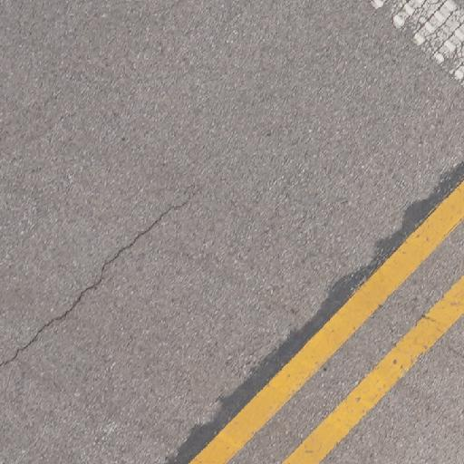
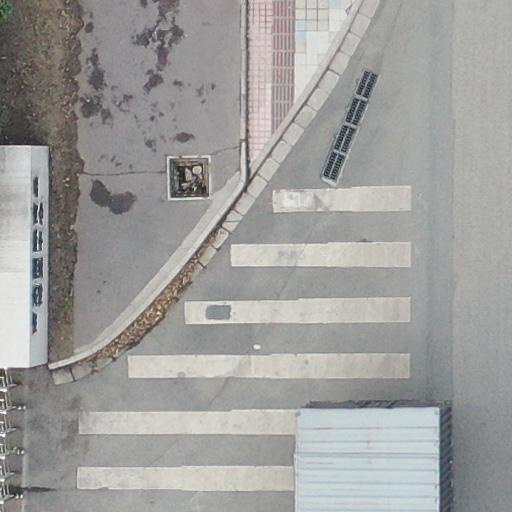
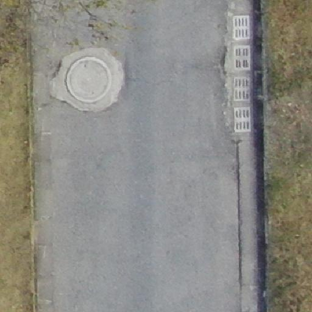
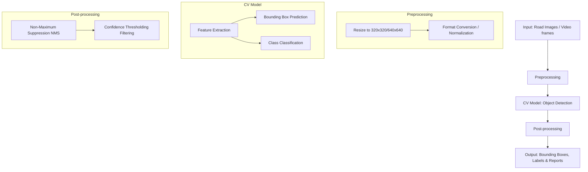

# Project Assignment # 1

## Group Members & Roles

| Name | Role |
| :--- | :--- |
| **[Student Name 1]** | Team Lead / System Architect |
| **[Student Name 2]** | CV Model Developer |
| **[Student Name 3]** | Data Analyst / Tester |

> [!NOTE]
> Please replace the bracketed names and roles with actual team member details.

---

## Part A — Problem Definition

### 1. Real-World Problem Being Solved

Road infrastructure degrades over time due to weather conditions, heavy traffic, and poor maintenance. Identifying and documenting road damage (such as cracks and potholes) manually is extremely labor-intensive, slow, prone to human error, and costly. Unaddressed road damage leads to vehicle wear and tear, traffic accidents, and significantly higher long-term repair costs for municipalities. Our objective is to automate the detection and classification of road damage to enable timely maintenance and budget allocation.

### 2. Why Computer Vision is Needed

Manual inspection requires human operators to physically survey roads or review hours of footage, which is inefficient and inconsistent. Computer Vision (CV) is needed because it allows for rapid, automated, and objective analysis of visual data from cameras. Advanced object detection models can identify multiple types of damage simultaneously in milliseconds, far exceeding human capabilities in speed and consistency, making large-scale surveys economically viable.

### 3. Expected System Inputs

- **Primary Input:** High-resolution digital images of road surfaces (captured via smartphone, vehicle-mounted cameras, or drones).
- **Secondary Input:** Video feeds (dashcames or live cameras) which will be processed frame-by-frame.
- **Format:** Standard image formats (JPEG, PNG) emphasizing clear views of the pavement.

### 4. Expected Outputs

- **Bounding Boxes & Labels:** Coordinates identifying the specific location of the damage on the image, categorized into specific damage types (e.g., longitudinal crack, pothole).
- **Confidence Scores:** A metric indicating the model's certainty of the detection.
- **Alerts/Reports:** Automated reports summarizing the frequency and type of damage detected over a specific road segment, which can be exported as CSV/JSON for municipal authorities.

---

## Part B — Dataset Analysis

### 1. Dataset Details

- **Dataset Name:** Road Damage Dataset 2022 (RDD2022) / Custom Balanced Sub-dataset
- **Source Link:** [RDD2022 GitHub Repository/Crowdsensing Dataset](https://datasetninja.com/road-damage-detector)

### 2. Dataset Volume

- **Total Training Images:** 974 images
- **Total Validation Images:** 244 images
- **Total Dataset Size:** 1,218 labeled images

#### Dataset Summary Table

| Split | Images |
| :--- | :--- |
| Training | 974 |
| Validation | 244 |
| Total | 1,218 |

### 3. Class Labels and Distribution

The dataset is annotated with bounding boxes for four primary damage categories. Based on our analysis of the training annotations, the distribution is as follows:

- **0 - Longitudinal Crack (`longitudinal_crack`):** 854 instances
- **1 - Transverse Crack (`transverse_crack`):** 760 instances
- **2 - Alligator Crack (`alligator_crack`):** 544 instances
- **3 - Pothole (`pothole`):** 768 instances

### 4. Sample Visual Examples

Below are links to sample visual examples included in our dataset. *(Note to user: Insert actual images into your PDF document from the `../data/sample_images` directory)*.

### 5. Identified Challenges

1. **Lighting & Shadows:** Overcast weather, strong sunlight, or shadows cast by trees and vehicles can obscure cracks or create false positives.
2. **Occlusion:** Vehicles, debris, or pedestrians might block the view of the road surface, preventing detection.
3. **Class Imbalance:** There is a noticeable under-representation of `alligator_crack` (544 instances) compared to `longitudinal_crack` (854 instances). This could lead the model to be biased against the minority class.
4. **Resolution/Clarity:** Varying camera qualities (from high-end drones to cheap dashcams) can cause fine cracks to blur out or become indistinguishable from the background texture.
5. **Motion Blur:** When capturing images from a moving vehicle, motion blur can severely distort fine details like transverse cracks.

---

## Part C — System Architecture Design

### 1. Block Diagram of System Pipeline

*(Note to user: When rendering to PDF, use a markdown viewer that supports Mermaid diagrams, or take a screenshot of the rendered diagram to paste into your Word/PDF doc).*

### 2. Offline vs Real-Time Processing

- **Offline Processing:** Used for analyzing large batches of images collected during a day's survey. Latency is not a primary constraint; accuracy is prioritized. High-resolution models can be used to generate comprehensive repair reports.
- **Real-Time Processing:** In a dashcam deployment, processing must happen at >15-30 FPS. This requires a lightweight, highly optimized model (like YOLOv8 Nano) capable of inferencing in milliseconds with minimal buffering.

### 3. Hardware Assumptions

- **Training Phase:** Assumes access to a dedicated GPU (e.g., NVIDIA RTX 3060/4090 or cloud instances like Google Colab T4) with at least 8GB of VRAM to handle batch sizes of 8-16.
- **Inference/Deployment Phase:** Assumes limited edge hardware (e.g., a standard laptop CPU or an edge device like Jetson Nano). Therefore, the system is designed to run efficiently on CPU architecture if needed.

### 4. Constraints

- **Latency:** For real-time applications, inference time per frame must stay below ~33ms (for 30 FPS).
- **Environment:** Must perform robustly across varying weather patterns (rain, glare) and road textures (asphalt, concrete).
- **Accuracy:** The model must minimize false positives so municipal workers aren't sent to investigate non-existent potholes.

---

## Part D — Model & Evaluation Plan

### 1. Proposed Baseline Approach

We propose using the **YOLOv8** (You Only Look Once version 8) architecture as our baseline object detection framework. Specifically, we will utilize the `yolov8n.pt` (Nano) variant as the initial starting point.

### 2. Why this Model is Suitable

- **Speed & Efficiency:** YOLOv8 Nano is extremely lightweight, containing fewer parameters, which perfectly aligns with our requirement for potential real-time CPU deployment and fast inference.
- **State-of-the-Art Architecture:** It possesses an anchor-free design and excellent feature pyramid network (FPN) structure, allowing it to detect road damages at varying scales (e.g., small cracks vs large potholes) very effectively.
- **Ease of Use:** The Ultralytics API simplifies training, validation, and export processes.

### 3. Fine-tuning Plan

**Yes, fine-tuning is planned.** While the YOLOv8 model is well-pretrained on the general MS COCO dataset, COCO does not contain road damage classes. We will initialize the model with COCO pre-trained weights (`yolov8n.pt`) and fine-tune all layers on our specific 1,218-image RDD dataset. We plan to train for ~50 epochs using an image size of 320x320 or 640x640 with a batch size of 8-16.

### 4. Evaluation Metrics

We will evaluate the trained models using standard object detection metrics:

- **mAP@50 (Mean Average Precision at IoU 0.5):** The primary metric to evaluate the overall performance across all four classes.
- **mAP@50-95:** A stricter metric evaluating precision over a range of Intersection over Union (IoU) thresholds, indicating the exactness of the bounding boxes.
- **Precision (P):** The ratio of correctly predicted positive observations to the total predicted positive observations. Crucial to minimize false alarms (municipal workers dispatch).
- **Recall (R):** The ratio of correctly predicted positive observations to all observations in the actual class. Crucial to ensure severe road damage is not missed.
- **Inference Speed (FPS/ms):** Time taken to process a single image/frame to evaluate real-time viability.
