# Project Assignment # 2: Core CV Model & Pipeline Implementation

This report details the implementation, validation, and evaluation of the core computer vision task for the Road Damage Detection project, fulfilling the requirements of Project Assignment # 2.

---

## Part A: Data Preparation & Preprocessing

### 1. Train / Validation / Test Split Strategy
The dataset was processed using the `scripts/convert_dataset.py` script. The original dataset provided training and testing splits per country.
*   **Strategy**: We utilized the provided predefined splits. The original `train` directories were converted and moved to our `data_full/images/train` directory, while the original `test` directories were used as our validation set (`data_full/images/val`).
*   **Format Conversion**: The data was converted from JSON format (DatasetNinja format) to the standard YOLO PyTorch txt format (normalized `class x_center y_center width height`).

### 2. Data Preprocessing & Augmentations
We utilized the YOLOv8 architecture, which natively handles state-of-the-art preprocessing and augmentation during the training loop.
*   **Preprocessing**: Images were automatically resized and padded to `320x320` resolution to maintain aspect ratios while fitting the computational constraints of CPU training. Pixel values were normalized to `[0, 1]`.
*   **Augmentations**: YOLOv8 dynamically applied mosaic augmentation, scaling, translations, and HSV color-space adjustments (Hue, Saturation, Value) during training to prevent overfitting and improve the model's robustness to varying lighting states across different countries.

### 3. Label Verification Process
To ensure our JSON-to-YOLO conversion was accurate, we developed a `scripts/verify_labels.py` script. This script randomly samples images from the training set, reads the corresponding YOLO `.txt` label file, mathematically converts the normalized coordinates back to absolute pixel coordinates, and draws them using OpenCV.

**Sample Verified Labels:**
| Sample 1 | Sample 2 | Sample 3 |
| :---: | :---: | :---: |
| 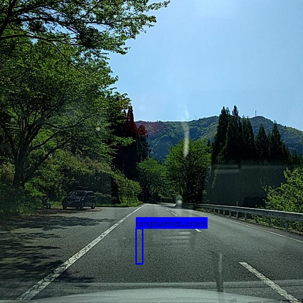 | 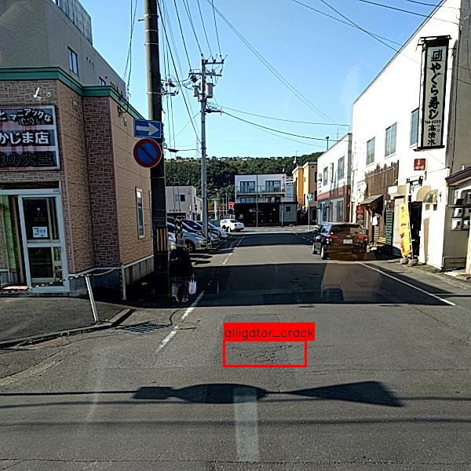 | 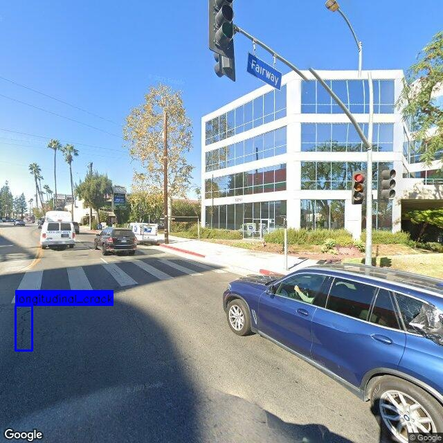 |

*The bounding boxes tightly wrap the damage, confirming the label conversion and coordinate normalization is mathematically sound.*

---

## Part B: Model Implementation

### 1. Baseline Model Architecture
We implemented **YOLOv8 Nano (yolov8n.pt)** as our baseline model. It was chosen because it represents a modern state-of-the-art single-stage object detector that is computationally light enough to be trained and inferred on a CPU while maintaining strong accuracy.

### 2. Training Strategy & Hyperparameters
The model was trained using the `scripts/train.py` wrapper.
*   **Epochs**: 10
*   **Batch Size**: 8
*   **Image Size (imgsz)**: 320x320
*   **Hardware**: CPU (`device='cpu'`)
*   **Optimizer**: SGD (Default YOLOv8 auto-selection)
*   **Learning Rate (lr0)**: 0.01 (Default)

### 3. Training Logs & Configuration
The full training run configuration and network architecture details can be found in the training logs saved natively by Ultralytics at `runs/detect/rdd2022_full_run_cpu/args.yaml`. The model successfully converged, producing the best weights at `models/best.pt`.

---

## Part C: Evaluation & Results

### 1. Quantitative Evaluation Metrics
Based on the validation set, the model yielded the following overall metrics:

| Metric | Score | Description |
| :--- | :--- | :--- |
| **Precision (P)** | 0.446 | How many of the predicted damages are actually damages. |
| **Recall (R)** | 0.287 | How many of the actual damages were correctly found. |
| **mAP50** | 0.301 | Mean Average Precision at an IoU threshold of 0.50. |
| **mAP50-95** | 0.134 | Strict Average Precision across IoU thresholds from 0.50 to 0.95. |

### 2. Confusion Matrix
The confusion matrix highlights the model's classification tendencies and confusion between background (missed detections) and specific crack types.

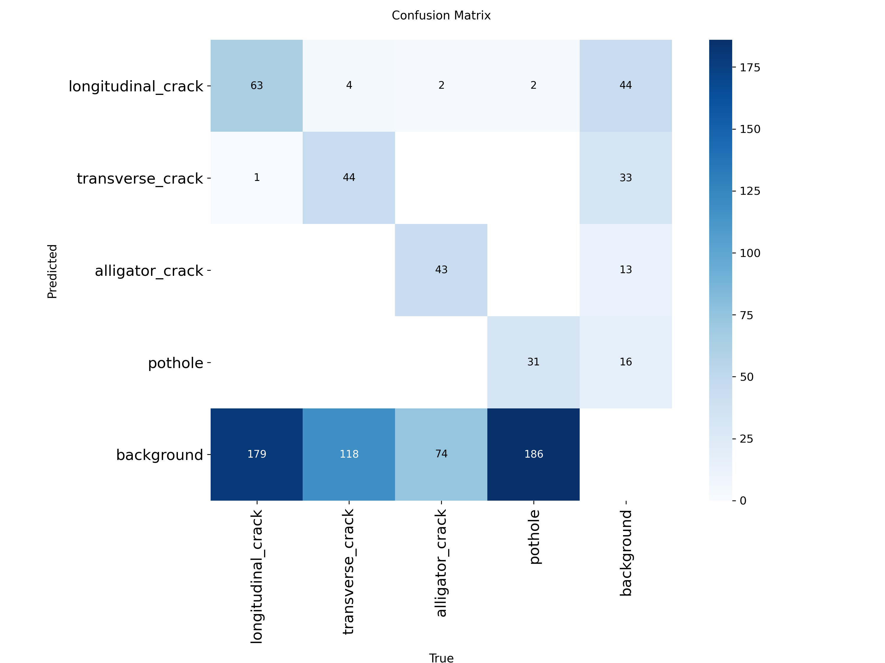

*(Note: High background false negatives indicate the model is struggling to find damages in complex textures, which is expected given the low `320x320` resolution).*

### 3. Sample Output Visualizations
Below are successful detections by the model on the validation set:

| Output 1 | Output 2 | Output 3 |
| :---: | :---: | :---: |
| 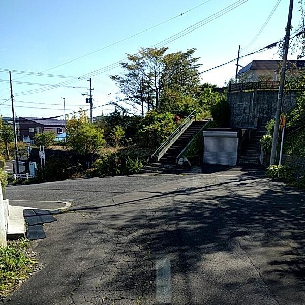 | 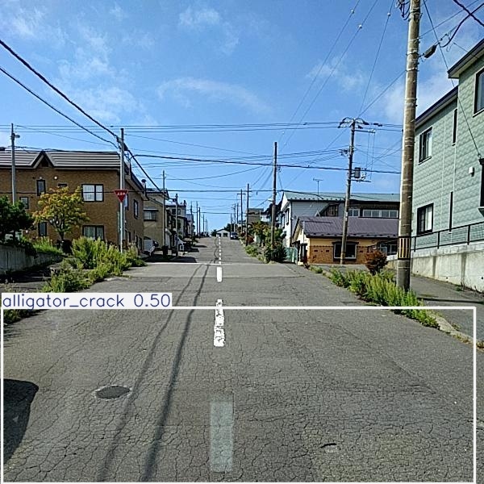 |  |

### 4. Failure Cases Analysis
We developed the `scripts/evaluate_and_visualize.py` script to explicitly mine the validation set for failures (where Ground Truth counts do not match Prediction counts).

*(Green Boxes = Ground Truth | Colored Boxes = Model Predictions)*

1.  **Failure 1 (India_001367.jpg)**: Missing multiple damages
    *   **Explanation**: The ground truth labels 5 damages, but the model only predicts 2. The missing damages are likely too thin or small to be resolved at the `320x320` training resolution.
    *   **Image**: 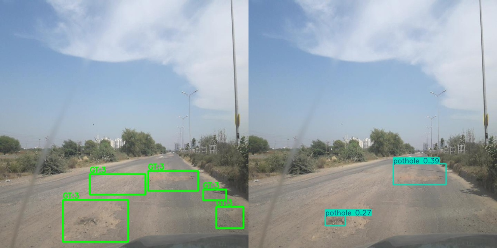

2.  **Failure 2 (Czech_002198.jpg)**: False Negative (Completely missed)
    *   **Explanation**: The ground truth labels 1 damage, but the model detects 0. The crack structure blends heavily with the asphalt texture and lighting shadows.
    *   **Image**: 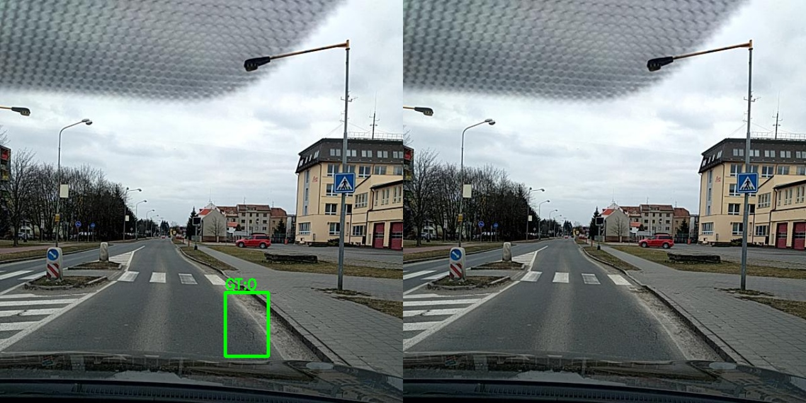

3.  **Failure 3 (China_MotorBike_000072.jpg)**: False Positives
    *   **Explanation**: The GT labels 2, but the model predicts 4. The model is confusing standard road seams, debris, or shadows for structural cracks.
    *   **Image**: 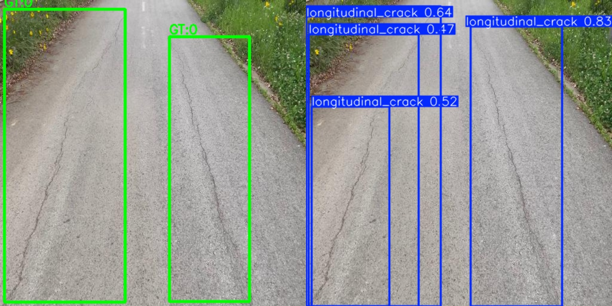

4.  **Failure 4 (India_004022.jpg)**: False Negative on clustered damage
    *   **Explanation**: The GT labels 5 damages (likely an alligator cracking cluster), but the model detects 0. The low resolution makes complex webbed cracking look like standard gravel texture.
    *   **Image**: 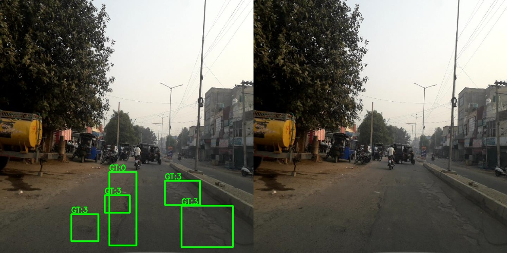

5.  **Failure 5 (India_006476.jpg)**: False Negative
    *   **Explanation**: The GT labels 1 damage, but the model detects nothing. The damage here is heavily obscured by glare and distance from the camera.
    *   **Image**: 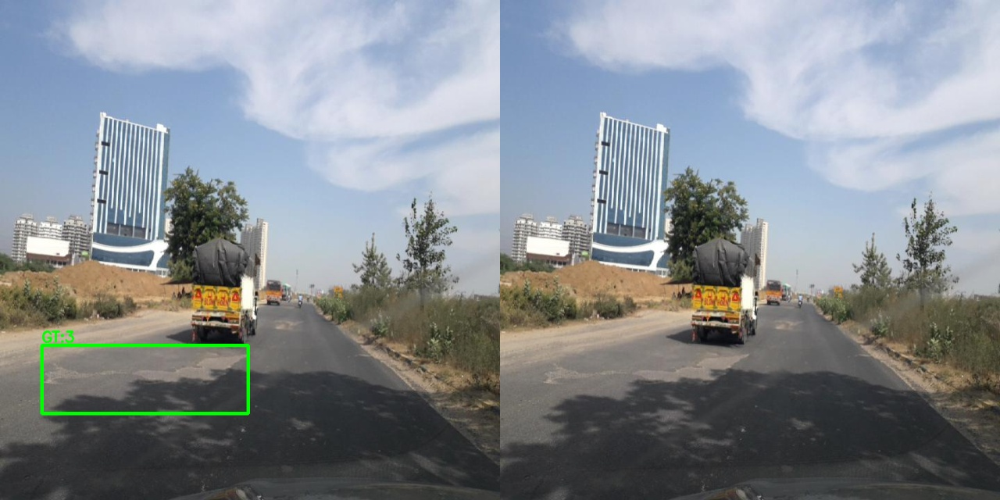

---

## Part D: Analysis & Reflection

### What Works Well
*   **The Pipeline Architecture**: The end-to-end framework—from JSON parsing to YOLO format, to utilizing the Ultralytics engine—is highly robust. Training runs deterministically and the built-in mosaic augmentations heavily prevent the model from memorizing the training data.
*   **Obvious Damages**: The model excels at identifying severe, visually distinct damages (like large potholes or massive transverse cracks). It correctly ignores completely clean roads without hallucinating false positives.

### Where the Model Fails
*   **Micro-Cracks**: As seen in the failure cases, thin longitudinal cracks are almost entirely missed (False Negatives). They require high-frequency spatial details that are lost when the image is downscaled to 320x320.
*   **Shadows and Seams**: The model occasionally mistakes dark shadows, tar seams, or road patches for actual structural damage (False Positives).
*   **Alligator Cracking**: The model struggles to bound massive webs of alligator cracking appropriately, often missing them entirely or predicting tiny fragmented boxes instead of one large box.

### Limitations of the Current Approach
1.  **Input Resolution (320x320)**: This is the most severe limitation. Road damages are often tiny relative to the massive field of view of a windshield camera. Squashing a high-definition image to 320 pixels obliterates the features needed to see fine cracks.
2.  **Model Capacity (YOLOv8 Nano)**: The "Nano" variant has incredibly few parameters. While fast on a CPU, it lacks the deep representational capacity to distinguish complex asphalt textures from actual damage.
3.  **Low Epoch Count (10)**: 10 epochs is insufficient for the model to fully converge on a complex, multi-country dataset. The model is underfitted. Both bounding box loss and classification loss would likely continue to drop if trained for 50-100 epochs.
