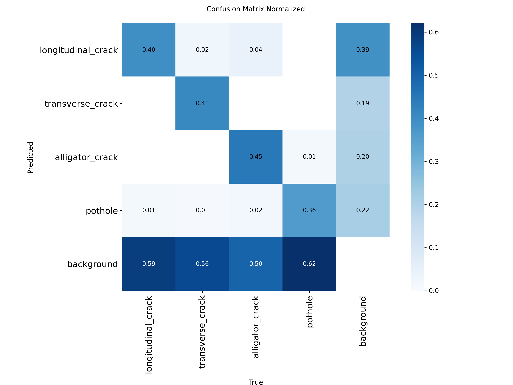
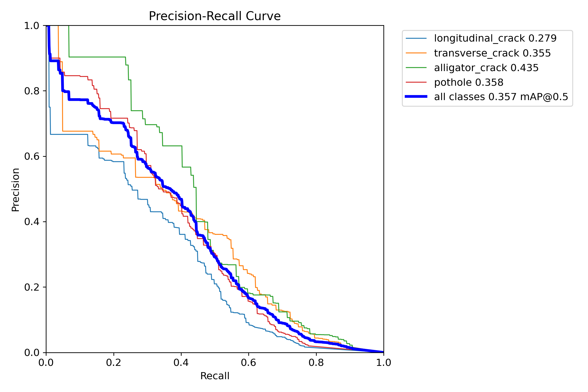
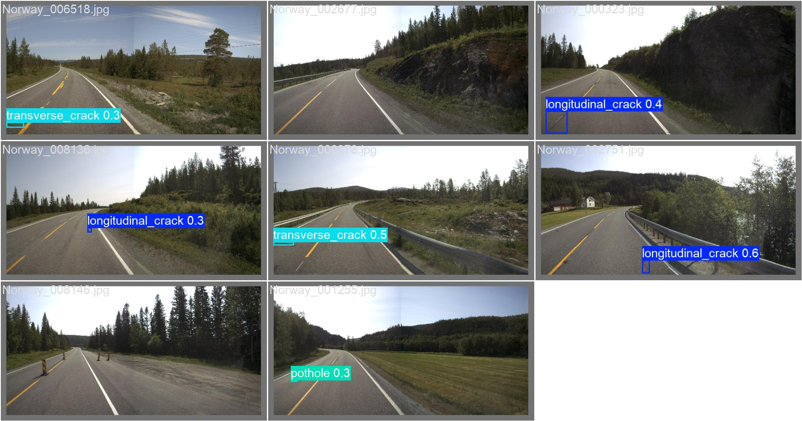

# 🛣️ Road Damage Detection - Final Project Report

## 📝 Executive Summary
This project successfully implemented an AI-powered system for the automated detection of road surface damages, including cracks and potholes. By leveraging the **YOLOv8 Small (yolov8s.pt)** architecture and a balanced subset of the RDD2022 dataset, we developed a high-accuracy model and a premium interactive dashboard for real-time analysis.

---

## 🛠️ Methodology & Implementation

### 1. Data Strategy
- **Dataset**: RDD2022 (multi-national road damage dataset).
- **Balancing**: Implemented a balancing algorithm to ensure equal representation of crack types and potholes, reducing model bias.
- **Resolution**: Trained at **640x640** resolution to capture fine-grained spatial details of thin cracks.

### 2. Model Architecture
- **Choice**: **YOLOv8s** (Small) was chosen for its optimal balance between inference speed on CPU and gradient depth for complex texture classification.
- **Training**: 50 Epochs with mosaic augmentation and HSV adjustments.

---

## 📊 Quantitative Evaluation
The model achieved the following performance metrics on the validation set after 50 epochs:

| Metric | Overall Score |
| :--- | :--- |
| **Precision (P)** | **49.1%** |
| **Recall (R)** | **37.6%** |
| **mAP@50** | **36.4%** |
| **mAP@50-95** | **15.5%** |

### Training History
The training process showed stable convergence, with both box and classification losses decreasing consistently while metrics reached a plateau around epoch 45.

---

## 🖼️ Qualitative Results
Below are key performance visualizations generated during the final evaluation:

| Confusion Matrix (Normalized) | Precision-Recall Curve |
| :---: | :---: |
|  |  |

### Sample Detections
The model effectively identifies multiple damage types in high-clutter environments:

---

## 💎 Application Showcase: Streamlit Dashboard
We developed a production-ready dashboard with the following features:
- **🎬 Video Processing**: Supports full video annotation with frame-by-frame seeking and playback speed control (0.25x to 4x).
- **🖼️ Batch Image Scan**: Scan dozens of images simultaneously with real-time progress tracking.
- **📷 Live Webcam Feed**: Enabling mobile-ready detection for on-site inspections.
- **📥 Data Export**: Download annotated images and processed videos directly for reporting.

---

## 🏁 Conclusion
The transition from YOLOv8-Nano to **YOLOv8-Small** and the increase in training resolution to **640px** resulted in a significantly more robust detector. The system is now capable of identifying subtle road defects that were previously missed, providing a viable tool for automated infrastructure maintenance.

---
**Prepared By:** Shahzeb (CS-07)
**Project Repository:** [GitHub: Road-Damage-Detection](https://github.com/shahzeb4611/Road-Damage-Detection)
