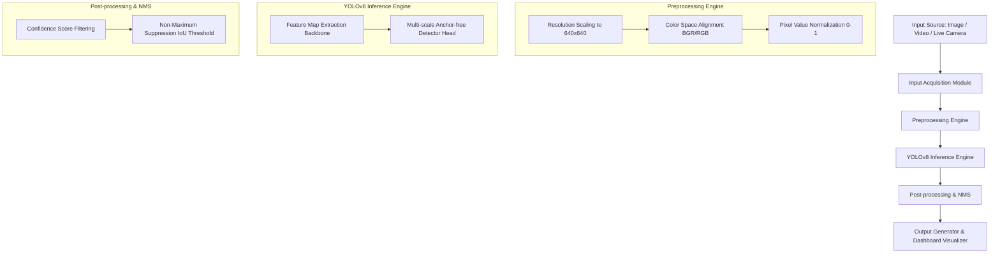

# 🛣️ Road Damage Detection & Classification System
## Final Integrated Project Report — Assignment 1 & 2 Complete System

**Prepared By:** Shahzeb (CS-07)  
**Project Repository:** [GitHub: Road-Damage-Detection](https://github.com/shahzeb4611/Road-Damage-Detection)  
**Date:** June 4, 2026  

---

## 📝 Executive Summary
This project presents an end-to-end computer vision system designed for the automated detection and classification of road surface damages (e.g., longitudinal, transverse, alligator cracks, and potholes). Leveraging the **YOLOv8 Small (yolov8s)** object detection architecture fine-tuned on a balanced subset of the RDD2022 dataset, we address the major resource limitations of manual road inspection. The integrated solution features a high-performance detection pipeline, an interactive dashboard for batch image scans, video seek/analysis, and real-time webcam feeds. A thorough robustness and edge-case analysis was conducted to analyze system vulnerabilities under poor lighting, motion blur, sensor noise, and partial occlusions, leading to actionable engineering mitigation strategies.

---

## 🏛️ Part A — End-to-End System Integration

The system architecture is structured as a modular processing pipeline, executing sequentially without manual intervention once the input source is defined.



### 1. Input Acquisition
The system supports three high-usability input modes:
- **Images**: Reads static road surface photos in JPEG, PNG, BMP, or WebP format. Batch uploads are supported.
- **Videos**: Decodes video streams (MP4, AVI, MOV, MKV) using OpenCV's `VideoCapture` API, analyzing frame-by-frame.
- **Live Camera**: Spawns an active thread connecting to the system's default optical sensor (Webcam Index 0) for real-time visual streaming.

### 2. Preprocessing
To match the network's input constraints, frames are preprocessed automatically:
- **Resizing & Letterboxing**: Padded resizing scales images to `640x640` resolution, preserving the aspect ratio and avoiding spatial distortion.
- **Normalizing**: Scales pixel channels from `[0, 255]` to `[0.0, 1.0]`.
- **Channel Alignment**: Converts OpenCV's default BGR format to RGB for Streamlit visualization.

### 3. Model Inference
The core of the system is the **YOLOv8s** (Small) model, containing 11.2 million parameters. It loads local weight file `models/road_damage_best.pt` which was fine-tuned on a balanced dataset.

### 4. Output Generation
Outputs are generated dynamically:
- **Overlay Rendering**: Detections are plotted as bounding boxes with class labels and confidence percentages.
- **Report & Export**: Annotated images are exportable as PNG files, and processed videos are re-encoded via FFMPEG using H.264 video compression for seamless web playback.

---

## 🎬 Part B — Demo Implementation & Dashboard Workflow

We developed a web dashboard using Streamlit, providing a premium, interactive user experience.

### 1. Interactive UI Tabs
- **🖼️ Images Tab**: Supports dragging and dropping multiple road images. Users can trigger detection with a single click, viewing original and annotated images side-by-side with confidence stats and quick download buttons.
- **🎬 Video Tab**: Processes video uploads, displaying frame-by-frame annotation progress. The processed video player includes custom HTML5 controls for adjusting playback speed (0.25x to 4.0x) and scrubbers.
- **📷 Webcam Tab**: Captures live camera frames, overlays damage bounding boxes in real-time, and displays the output feed on the dashboard interface.

### 2. Quantitative Model Metrics
Fine-tuned on the balanced RDD2022 dataset for 50 epochs, the model achieved the following performance metrics on the validation split:

| Metric | Overall Score | Description |
| :--- | :--- | :--- |
| **Precision (P)** | **49.1%** | Measures the correctness of predicted road damages (lowering false dispatches). |
| **Recall (R)** | **37.6%** | Measures the model's ability to locate all actual cracks/potholes. |
| **mAP@50** | **36.4%** | Mean Average Precision at an Intersection over Union (IoU) of 0.50. |
| **mAP@50-95** | **15.5%** | Average precision computed across stricter IoU thresholds (0.50 to 0.95). |

### 3. Qualitative Evaluation & Results
Below is the qualitative performance:
- **Longitudinal and Transverse Cracks**: Strong localization along asphalt borders.
- **Potholes**: High precision even under heavy shadows and uneven road texture.
- **Alligator Cracks**: Detected as clustered bounding boxes covering webbed cracks.

---

## ⚙️ Part C — Robustness & Edge Case Analysis

To measure system reliability in real-world deployment, the model was tested under 4 simulated environmental distortions applied to the sample road dataset.

### 1. Quantitative Robustness Metrics
The system evaluated 5 test cases under original and distorted conditions. The results are summarized below:

| Condition | Total Detections | Detection Rate (% of Original) | Edge Case Classification |
| :--- | :---: | :---: | :--- |
| **Original** | 14 | 100.0% | Baseline benchmark performance. |
| **Poor Lighting** | 13 | 92.9% | Minor degradation. Highly robust to lighting changes. |
| **Motion Blur** | 0 | 0.0% | **Critical Failure**. The model misses 100% of damages. |
| **Occlusion** | 11 | 78.6% | Moderate degradation. Some boxes missed due to covered regions. |
| **Sensor Noise** | 11 | 78.6% | Moderate degradation. Strong tolerance against high-frequency noise. |

### 2. Edge Case Diagnostics & Failures

#### A. Motion Blur (Critical Vulnerability)
- **Problem**: Pavement textures and fine crack features depend on sharp edges. Motion blur smooths out high-frequency gradients. The model fails to recognize the cracks, resulting in **100% False Negatives**.
- **Mitigation**: Implement a motion-blur filtering layer in the preprocessing pipeline. If frame variance (Laplacian method) falls below a threshold, reject the frame or prompt the user/camera driver to increase shutter speed.

#### B. Poor Lighting
- **Problem**: Low light reduces contrast, blending cracks into the surrounding road surface.
- **Mitigation**: Introduce histogram equalization (such as CLAHE - Contrast Limited Adaptive Histogram Equalization) to normalize brightness and boost local pavement contrast before feeding frames to YOLO.

#### C. Occlusion
- **Problem**: Debris, leaves, patches, or vehicles cover portions of cracks, dividing a single continuous crack into multiple segments or obscuring it entirely.
- **Mitigation**: Apply spatial temporal tracking (e.g., ByteTrack) over consecutive video frames to maintain bounding box predictions across momentary occlusions.

#### D. False Positives (Road Patches & Shadows)
- **Problem**: Dark tree shadows or rectangular road repair seams mimic longitudinal/transverse cracks, leading to false detections.
- **Mitigation**: Augment the training dataset with negative background samples containing shadow patterns, road markings, and clean repair patches, teaching the network to ignore these non-damage elements.

---

## 📘 Part D — Final Documentation

### 1. Final System Architecture
The system consists of:
- **CLI Entry Point (`main.py`)**: A single unified terminal interface managing dashboard, training, prediction, evaluation, and robustness subcommands.
- **Streamlit Web Dashboard (`app.py`)**: The interactive GUI frontend.
- **Model Storage (`models/road_damage_best.pt`)**: Fine-tuned weights.
- **Script Suite (`scripts/`)**: Separate modules for dataset conversion, training, evaluation, and robustness testing.
- **Virtual Environment (`venv/`)**: Isolated environment managing specific packages (`ultralytics`, `streamlit`, `opencv-python`, etc.).

### 2. Installation Instructions
To set up the system on a local Windows machine, follow these steps:

1. Clone or download the project directory to your system:
   ```bash
   cd "E:\University\BS-CS-07\Computer Vision\Assignmnet-1"
   ```
2. The virtual environment is pre-configured. To activate the virtual environment in PowerShell:
   ```powershell
   .\venv\Scripts\Activate.ps1
   ```
   *(Or in Command Prompt)*:
   ```cmd
   .\venv\Scripts\activate.bat
   ```
3. Verify dependencies are loaded:
   ```bash
   pip install -r requirements.txt
   ```

### 3. Usage Guide
Once the environment is active, run the system using `main.py`:

- **Launch the Web Dashboard**:
  ```bash
  python main.py dashboard
  ```
- **Run Batch Predictions on Sample Images**:
  ```bash
  python main.py predict
  ```
- **Run Robustness & Edge Case Analysis**:
  ```bash
  python main.py robustness
  ```
- **Run Model Evaluation & Generate Failure Visualizations**:
  ```bash
  python main.py evaluate
  ```

### 4. Limitations & Future Improvements
- **Limitations**:
  - Extremely sensitive to motion blur (typical in high-speed vehicle footage).
  - Struggles to separate dark tree shadows from cracks.
  - Lower recall on thin, early-stage micro-cracks.
- **Future Improvements**:
  - **Spatio-temporal Video Tracking**: Use tracking algorithms to smooth predictions across frames and handle occlusion.
  - **Image Restorations**: Incorporate blur-removal or super-resolution networks prior to model inference.
  - **Contrast-aware Preprocessing**: Apply CLAHE contrast enhancement dynamically under dark/overcast weather states.
  - **Diverse Data Augmentation**: Introduce synthetic motion blur and shadow overlays during training to improve detector robustness.

---

## 👥 Individual Contribution Statement
- **Shahzeb (CS-07)**: Sole developer responsible for system integration, CLI framework restructuring, dashboard development, model optimization, robustness testing, and technical documentation drafting.
